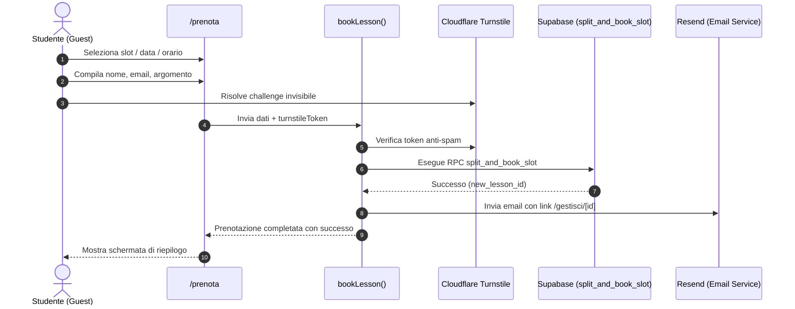
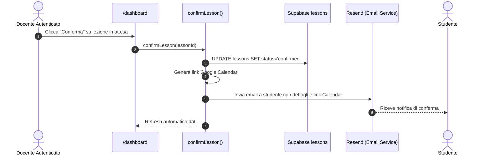

# EduBook - Documentazione Tecnica per Sviluppatori

Benvenuto nella documentazione tecnica interna di **EduBook**. Questo documento fornisce una panoramica approfondita dell architettura del software, del modello dei dati su Supabase Postgres, di tutte le Server Actions implementate, dei flussi operativi e delle linee guida architetturali per estendere il sistema nel rispetto degli standard di qualita (SonarCloud Rating A, Zero Code Smells, Zero Duplication).

---

## 1. Architettura del Software: Vertical Slice Architecture (VSA)

EduBook adotta il pattern architetturale **Vertical Slice Architecture (VSA)**. A differenza dell architettura a livelli tradizionale (Layered Architecture: controllers, services, repositories separati a livello globale), il codice e organizzato attorno alle **funzionalita di business** (slices).

### Struttura Directory `src/`

```
src/
|-- app/                              # Next.js 15 App Router (Routing e Layouts)
|   |-- (public)/                     # Rotte pubbliche (/, /prenota, /gestisci/[id], /contatti, /privacy)
|   |-- dashboard/                    # Rotte protette docente (/dashboard, /dashboard/profilo)
|   |-- auth/callback/                # Callback OAuth / password recovery
|   `-- api/cron/cleanup/             # Cron endpoint manutenzione slot scaduti
|
|-- features/                         # Feature Slices (Vertical Slices)
|   |-- auth/                         # Login professore, password recovery, sessioni
|   |   |-- actions/                  # Server Actions autenticazione
|   |   |-- components/               # AuthModal, LoginForm, ResetPasswordForm
|   |   |-- schemas/                  # Validazione Zod per auth
|   |   `-- utils/                    # requireAuth(), session helpers
|   |
|   |-- booking/                      # Prenotazione studente guest e gestione autonoma
|   |   |-- actions/                  # booking.actions.ts, manage.actions.ts
|   |   |-- components/               # BookingCalendar, BookingForm, StudentManageView
|   |   |-- schemas/                  # booking.schema.ts
|   |   `-- types/                    # booking.types.ts
|   |
|   |-- contact/                      # Modulo di contatto pubblico e messaggi
|   |   |-- actions/                  # contact.actions.ts
|   |   |-- components/               # ContactForm
|   |   `-- schemas/                  # contact.schema.ts
|   |
|   |-- dashboard/                    # Pannello di controllo professore
|   |   |-- actions/                  # dashboard.actions.ts
|   |   |-- components/               # OverviewCards, LessonCards, SlotManager, EditDialog
|   |   |-- schemas/                  # dashboard.schema.ts
|   |   |-- types/                    # dashboard.types.ts
|   |   `-- utils/                    # lesson-action-helpers.ts
|   |
|   |-- landing/                      # Landing page istituzionale
|   |   |-- components/               # HeroSection, BioSection, SubjectBadges, CTA, Footer
|   |   `-- utils/                    # get-public-profile.ts
|   |
|   `-- profile/                      # Personalizzazione profilo, materie, hero e percorso
|       |-- actions/                  # profile.actions.ts
|       |-- components/               # ProfileForm, WhyChooseUsCard, HeroCardConfigCard, CredentialsCard
|       |-- constants/                # why-choose-us.constants.ts, hero-card.constants.ts
|       `-- schemas/                  # profile.schema.ts
|
|-- components/ui/                    # Design System atomico (shadcn/ui + Radix UI)
|-- lib/                              # Integrazioni terze parti (resend, turnstile, email-templates)
`-- utils/supabase/                   # Client Supabase SSR (client.ts, server.ts, middleware.ts)
```

### Principi Guida VSA
1. **Basso accoppiamento, alta coesione**: ogni feature racchiude i propri componenti, schemi di validazione, azioni server e tipi.
2. **Nessun modello di dominio globale monolitico**: le fette espongono Server Actions indipendenti.
3. **DRY intelligente**: astrazioni condivise solo quando c e una reale identita semantica (es. `components/ui` per i componenti atomici, `lib/` per i client SDK esterni).
4. **Zero duplicazioni**: logiche comuni tra azioni (es. formattazione orari o revalidazione path) centralizzate in file helper dedicati come `lesson-action-helpers.ts`.

---

## 2. Modello del Database Supabase (PostgreSQL)

EduBook utilizza PostgreSQL gestito da Supabase. Di seguito vengono descritte le tabelle, i tipi e le funzioni stored.

### 2.1 Enumerazioni (Custom Types)

```sql
CREATE TYPE public.user_role AS ENUM ('student', 'professor', 'admin', 'superadmin');
CREATE TYPE public.lesson_status AS ENUM ('available', 'pending', 'confirmed', 'rejected', 'cancelled');
```

### 2.2 Schema delle Tabelle

#### Tabella `public.profiles`
Contiene le informazioni sul docente e le personalizzazioni della landing page.
- `id` (`UUID`, PK, FK verso `auth.users.id` ON DELETE CASCADE)
- `email` (`TEXT`, NOT NULL)
- `first_name` (`TEXT`, NULL)
- `last_name` (`TEXT`, NULL)
- `headline` (`TEXT`, NULL, es. "Docente di Scienze Matematiche")
- `bio` (`TEXT`, NULL)
- `phone` (`TEXT`, NULL)
- `role` (`public.user_role`, DEFAULT 'professor')
- `teaching_subjects` (`TEXT[]`, array delle materie abilitate)
- `subject_details` (`JSONB`, mappa materia -> descrizione o dettagli specifici)
- `suggested_subjects` (`TEXT[]`, suggerimenti per autocompletamento)
- `avatar_url` (`TEXT`, NULL)
- `why_choose_us` (`JSONB`, DEFAULT NULL, configurazione dinamica sezione "Gestione Percorso")
- `hero_card` (`JSONB`, DEFAULT NULL, configurazione dinamica card informativa in primo piano)
- `created_at` (`TIMESTAMPTZ`, DEFAULT now())
- `updated_at` (`TIMESTAMPTZ`, DEFAULT now())

#### Tabella `public.lessons`
Rappresenta sia gli slot di disponibilita inseriti dal docente, sia le lezioni prenotate dagli studenti.
- `id` (`UUID`, PK, DEFAULT gen_random_uuid())
- `start_time` (`TIMESTAMPTZ`, NOT NULL)
- `end_time` (`TIMESTAMPTZ`, NOT NULL)
- `is_available` (`BOOLEAN`, DEFAULT true) - `true` se lo slot e libero e prenotabile.
- `status` (`public.lesson_status`, DEFAULT 'available')
  - `'available'`: slot libero pubblicato dal docente.
  - `'pending'`: prenotato da uno studente guest, in attesa di conferma del docente.
  - `'confirmed'`: approvato dal docente.
  - `'rejected'`: rifiutato dal docente (con motivo opzionale).
  - `'cancelled'`: annullato successivamente dallo studente o dal docente.
- `guest_name` (`TEXT`, NULL, nome e cognome dello studente)
- `guest_email` (`TEXT`, NULL, email dello studente per notifiche)
- `notes` (`TEXT`, NULL, argomento richiesto o note dello studente)
- `rejection_reason` (`TEXT`, NULL, motivazione del rifiuto fornita dal docente)
- `reschedule_requested` (`BOOLEAN`, DEFAULT false, flag se lo studente ha chiesto di spostare)
- `reschedule_notes` (`TEXT`, NULL, note della richiesta di spostamento)
- `created_at` (`TIMESTAMPTZ`, DEFAULT now())
- `updated_at` (`TIMESTAMPTZ`, DEFAULT now())

#### Tabella `public.contacts`
Archivia i messaggi inviati tramite il modulo pubblico `/contatti`.
- `id` (`UUID`, PK, DEFAULT gen_random_uuid())
- `name` (`TEXT`, NOT NULL)
- `email` (`TEXT`, NOT NULL)
- `message` (`TEXT`, NOT NULL)
- `replied` (`BOOLEAN`, DEFAULT false)
- `created_at` (`TIMESTAMPTZ`, DEFAULT now())

### 2.3 Stored Procedure: `split_and_book_slot`
Garantisce la prenotazione atomica e la suddivisione dei **Mega-Slot**.
Se un docente pubblica uno slot di 3 ore (es. 15:00 - 18:00) e uno studente prenota 1 ora (16:00 - 17:00), la funzione in un unica transazione ACID:
1. Verifica la disponibilita e blocca la riga con `FOR UPDATE`.
2. Se la finestra richiesta coincide esattamente con lo slot, aggiorna lo slot in `pending`.
3. Se la finestra richiesta e un sotto-intervallo:
   - Crea un eventuale slot `available` per la porzione precedente (15:00 - 16:00).
   - Crea un eventuale slot `available` per la porzione successiva (17:00 - 18:00).
   - Converte lo slot originario nella prenotazione `pending` con i dati dello studente.

```sql
SELECT split_and_book_slot(
  p_slot_id := 'uuid',
  p_req_start := '2026-09-10T16:00:00Z',
  p_req_end := '2026-09-10T17:00:00Z',
  p_notes := 'Ripasso trigonometria',
  p_guest_name := 'Mario Rossi',
  p_guest_email := 'mario.rossi@example.com'
);
```

---

## 3. Riferimento Dettagliato delle Server Actions

Tutte le Server Actions risiedono sotto `src/features/*/actions/`, eseguono la validazione degli input a runtime tramite **Zod**, applicano controlli di sicurezza e invalidano selettivamente la cache Next.js (`revalidatePath`).

### 3.1 `features/auth/actions/auth.actions.ts`

| Funzione | Parametri Input | Output | Autenticazione Richiesta | Descrizione |
|---|---|---|---|---|
| `loginWithPassword` | `input: LoginInput` (`email`, `password`) | `{ success?: boolean, error?: string }` | No (Pubblico) | Esegue login professore verificando il ruolo (`admin`/`professor`/`superadmin`). Se il ruolo non e autorizzato, effettua il logout immediato. |
| `logoutAction` | Nessuno | `void` (reindirizza a `/`) | Si | Disconnette la sessione Supabase e pulisce i cookie di autenticazione. |
| `resetPasswordAction` | `input: ResetPasswordInput` (`email`) | `{ success?: boolean, message?: string, error?: string }` | No (Pubblico) | Invia l email con il link OTP per il ripristino della password a `/update-password`. |
| `updatePasswordAction` | `input: UpdatePasswordInput` (`newPassword`, `confirmPassword`) | `{ success?: boolean, error?: string }` | Si (tramite sessione di recupero) | Aggiorna la password dell utente autenticato su Supabase Auth. |

---

### 3.2 `features/booking/actions/booking.actions.ts`

| Funzione | Parametri Input | Output | Autenticazione Richiesta | Descrizione |
|---|---|---|---|---|
| `getAvailableSlots` | Nessuno | `Promise<AvailableSlot[]>` | No (Pubblico) | Restituisce tutti gli slot futuri con `is_available = true` e `status = 'available'`, ordinati cronologicamente. |
| `bookLesson` | `input: BookingSchemaInput` (`slotId`, `startTime`, `endTime`, `guestName`, `guestEmail`, `notes`, `turnstileToken`) | `Promise<BookingResult>` | No (Guest protetto da Turnstile) | 1. Valida schema Zod.<br>2. Verifica token anti-spam Turnstile.<br>3. Chiama RPC `split_and_book_slot`.<br>4. Invia email di conferma allo studente con link di gestione `/gestisci/[id]`.<br>5. Invalida cache di `/prenota` e `/dashboard`. |

---

### 3.3 `features/booking/actions/manage.actions.ts`

| Funzione | Parametri Input | Output | Autenticazione Richiesta | Descrizione |
|---|---|---|---|---|
| `getLessonById` | `id: string` (UUID della lezione) | `Promise<Lesson \| null>` | No (UUID funge da token segreto) | Valida l UUID con regex e recupera i dettagli della prenotazione per la visualizzazione nella pagina studente `/gestisci/[id]`. |
| `requestReschedule` | `input: RescheduleSchemaInput` (`lessonId`, `rescheduleNotes`, `turnstileToken`) | `Promise<RescheduleResult>` | No (Studente con UUID valido) | Registra la richiesta di spostamento della lezione (`reschedule_requested = true`), invia notifica email al docente e revalida i path. |

---

### 3.4 `features/contact/actions/contact.actions.ts`

| Funzione | Parametri Input | Output | Autenticazione Richiesta | Descrizione |
|---|---|---|---|---|
| `sendContactMessage` | `input: ContactSchemaInput` (`name`, `email`, `message`, `turnstileToken`) | `Promise<ContactActionResult>` | No (Pubblico con Turnstile) | Salva il messaggio in `public.contacts` e invia notifica email automatica al professore. |
| `getContactMessages` | Nessuno | `Promise<ContactMessage[]>` | Si (Docente) | Restituisce la lista di tutti i messaggi ricevuti ordinati per data decrescente. |

---

### 3.5 `features/dashboard/actions/dashboard.actions.ts`

Tutte le azioni di questo modulo richiedono l autenticazione tramite `requireAuth()`.

| Funzione | Parametri Input | Output | Descrizione |
|---|---|---|---|
| `getDashboardData` | Nessuno | `Promise<DashboardData>` | Recupera in parallelo lezioni in attesa, confermate, slot disponibili e messaggi di contatto, aggregando statistiche. |
| `createSlot` | `input: CreateSlotInput` (`startDate`, `endDate`, `repeatWeeks?`) | `Promise<DashboardActionResult>` | Crea uno slot singolo o una serie ricorrente settimanale (fino a 12 settimane), prevenendo sovrapposizioni. |
| `confirmLesson` | `lessonId: string` | `Promise<DashboardActionResult>` | Imposta la lezione su `confirmed`, genera il link dinamico Google Calendar, invia email allo studente e revalida la dashboard. |
| `rejectLesson` | `input: RejectLessonInput` (`lessonId`, `rejectionReason`, `keepSlotAvailable`) | `Promise<DashboardActionResult>` | Rifiuta la lezione (`rejected`), invia email di notifica allo studente con la motivazione e opzionalmente ripristina o elimina lo slot. |
| `cancelLesson` | `input: CancelLessonInput` (`lessonId`, `keepAvailable`) | `Promise<DashboardActionResult>` | Annulla una lezione gia confermata, notifica lo studente e gestisce il ripristino o eliminazione dello slot orario. |
| `editLessonTime` | `input: EditLessonTimeInput` (`lessonId`, `startTime`, `endTime`) | `Promise<DashboardActionResult>` | Modifica data/ora di una lezione (in attesa o confermata), aggiorna il DB e invia email con il nuovo orario e nuovo link Google Calendar. |
| `deleteAvailableSlot` | `slotId: string` | `Promise<DashboardActionResult>` | Elimina fisicamente uno slot libero non prenotato. |
| `runManualCleanup` | Nessuno | `Promise<CleanupResult>` | Elimina gli slot liberi passati, le richieste scadute e lezioni archiviate piu vecchie di 365 giorni. |

---

### 3.6 `features/profile/actions/profile.actions.ts`

Tutte le azioni di questo modulo richiedono l autenticazione tramite `requireAuth()`.

| Funzione | Parametri Input | Output | Descrizione |
|---|---|---|---|
| `getProfile` | Nessuno | `Promise<Profile \| null>` | Recupera il profilo completo del docente autenticato, inclusi i dati anagrafici, materie, `why_choose_us` e `hero_card`. |
| `updateProfile` | `input: ProfileInput` | `Promise<ProfileActionResult>` | Aggiorna nome, cognome, headline, bio, telefono, materie insegnate e subject details. Invalida `/` e `/dashboard/profilo`. |
| `updateCredentials` | `input: CredentialsInput` | `Promise<ProfileActionResult>` | Aggiorna email e/o password di accesso dell account docente tramite Supabase Auth Admin. |
| `updateWhyChooseUs` | `input: WhyChooseUsInput` | `Promise<ProfileActionResult>` | Salva la configurazione personalizzata della sezione "Gestione Percorso" (titolo, sottotitolo e schede da 1 a 6). Invalida cache `/`. |
| `resetWhyChooseUs` | Nessuno | `Promise<ProfileActionResult>` | Ripristina `why_choose_us` a `NULL` sul DB, attivando il fallback trasparente ai valori predefiniti. |
| `updateHeroCard` | `input: HeroCardInput` | `Promise<ProfileActionResult>` | Salva la configurazione della scheda in primo piano della Hero (righe informative 1-5 e nota opzionale). Invalida cache `/`. |
| `resetHeroCard` | Nessuno | `Promise<ProfileActionResult>` | Ripristina `hero_card` a `NULL` sul DB, tornando ai valori predefiniti di fabbrica. |

---

## 4. Flussi Operativi di Business

### 4.1 Flusso di Prenotazione Studente (Guest)


### 4.2 Flusso di Approvazione Docente


---

## 5. Protezione e Sicurezza

1. **Autenticazione a Livello Server (SSR)**:
   - Cookie HTTP-Only crittografati gestiti tramite `@supabase/ssr`.
   - Utility centralizzata `requireAuth()` che valida la sessione e verifica che l utente appartenga al ruolo docente/amministratore. In caso negativo, blocca la Server Action.
2. **Protezione Anti-Bot Cloudflare Turnstile**:
   - I form pubblici (`/prenota`, `/gestisci/[id]`, `/contatti`) integrano il widget Turnstile. Il backend convalida il token segreto tramite endpoint Cloudflare prima di eseguire qualsiasi query sul database.
3. **Validazione Rigida degli Schemi (Zod)**:
   - Nessun dato proveniente dal client viene passato alle query senza essere prima validato e sanificato (lunghezza massima, regex formato email, regex formato UUID, validazione logica date e orari).
4. **Protezione Accesso ai Dati Studente (`/gestisci/[id]`)**:
   - L accesso alla gestione della singola prenotazione avviene solo tramite l UUID casuale v4 generato dal database. L UUID funge da token di possesso univo e non enumerabile.

---

## 6. Manutenzione Automatica e Cron Job

L endpoint `/api/cron/cleanup` e progettato per essere richiamato periodicamente (ad es. ogni notte tramite Vercel Cron o cronjob esterno).

- **Metodo**: `GET /api/cron/cleanup`
- **Header Richiesto**: `Authorization: Bearer <CRON_SECRET>`
- **Operazioni Eseguite**:
  1. Cancellazione slot con `status = 'available'` e `end_time < NOW()`.
  2. Cancellazione richieste in attesa con `status = 'pending'` e `end_time < NOW()`.
  3. Cancellazione lezioni archiviate piu vecchie di 365 giorni.
- **Risposta JSON**:
  ```json
  {
    "success": true,
    "cancelledExpired": 2,
    "deletedSlots": 5,
    "timestamp": "2026-09-06T18:00:00.000Z"
  }
  ```

---

## 7. Linee Guida per Nuovi Sviluppatori

Quando aggiungi nuove funzionalita a EduBook, segui queste regole per mantenere il codice pulito e conforme a SonarCloud Rating A:

1. **Aggiungere una nuova Feature Slice**:
   - Crea `src/features/<nome-feature>/`.
   - Includi `actions/`, `components/`, `schemas/`, e `types/`.
   - Non importare mai moduli privati interni di un altra feature. Condividi solo costanti o componenti comuni in `components/ui/` o `lib/`.
2. **Creare una nuova Server Action**:
   - Inserisci sempre `"use server";` in cima al file.
   - Valida sempre gli input con `schema.safeParse()`.
   - Se l azione e riservata al professore, invoca `await requireAuth();` come prima riga.
   - Usa `createAdminClient()` per operazioni di backend protette che richiedono bypass RLS sicuro.
   - Gestisci sempre i blocchi `try/catch` restituendo un oggetto standard `{ success: boolean, error?: string }` senza lanciare eccezioni non gestite verso il client.
3. **Validazione e Build**:
   - Esegui sempre `npm run lint` e `npm run build` prima di ogni commit per assicurarti che non ci siano errori di tipo o warning ESLint.
